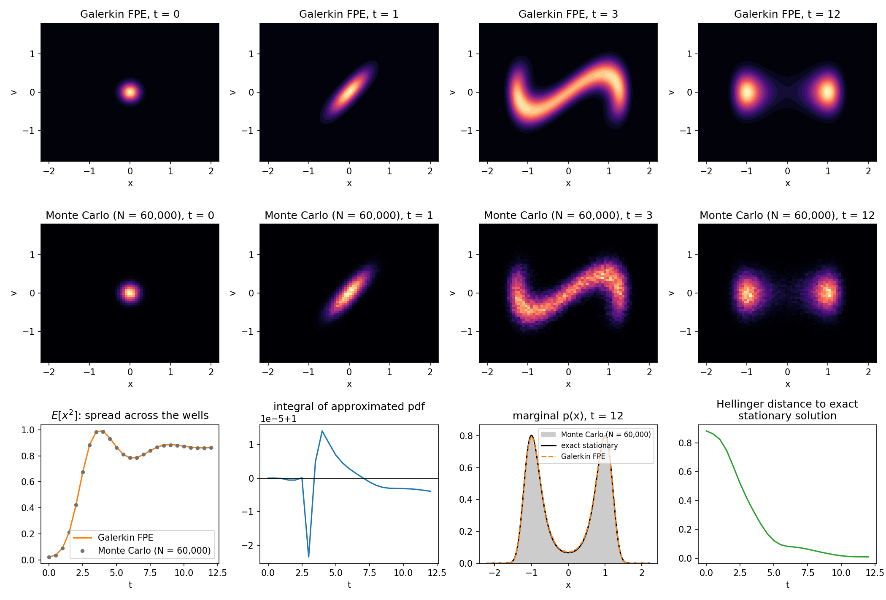
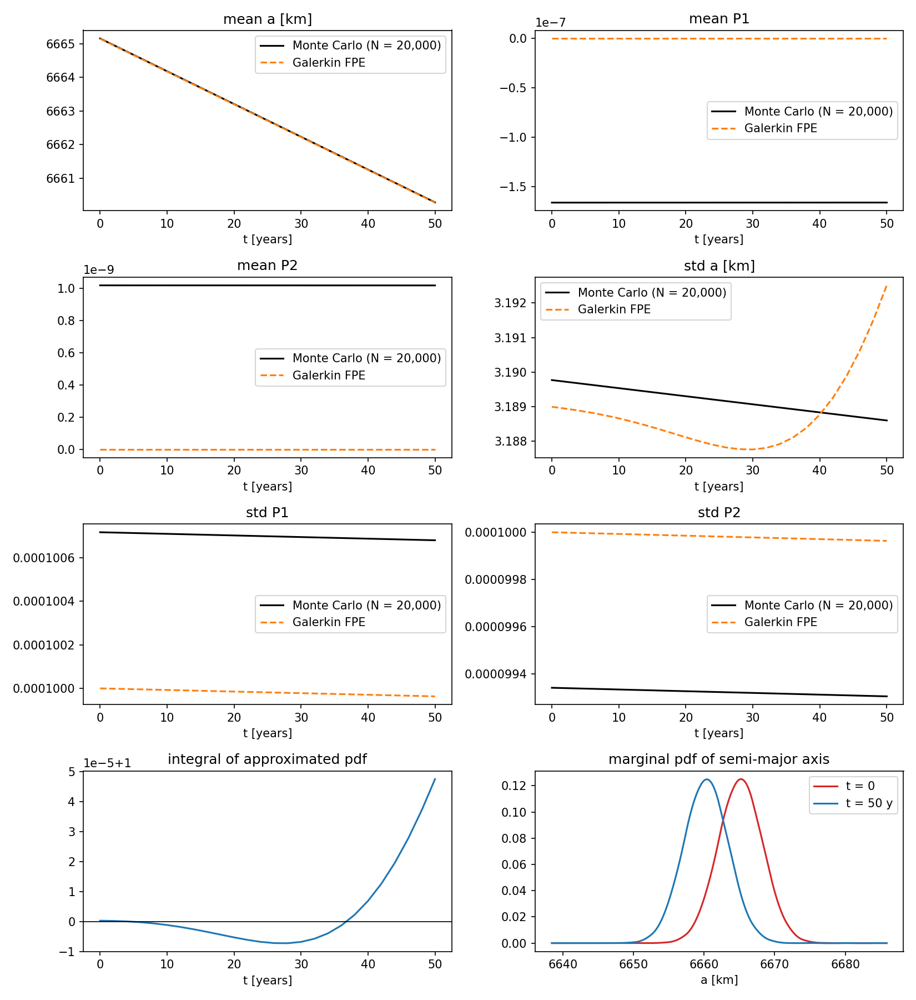
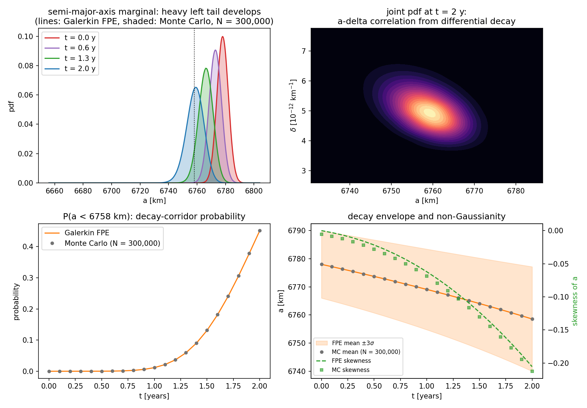
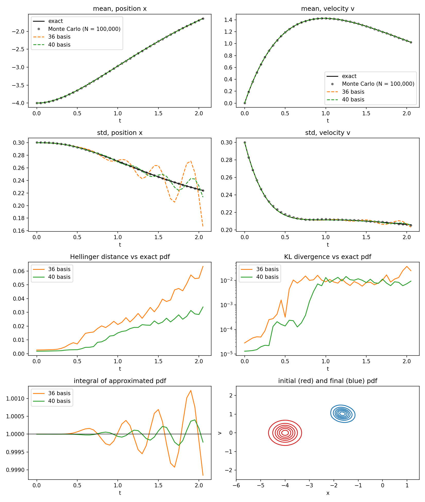

# Uncertainty propagation in orbital dynamics via Galerkin projection of the Fokker-Planck Equation

[](https://github.com/Sceki/fpe/actions/workflows/ci.yml)
[](LICENSE)
[](https://doi.org/10.1016/j.asr.2023.11.042)

Uncertainty propagation for (orbital) dynamics by solving the
**Fokker–Planck equation** with a **Galerkin projection** onto tensor-product
B-spline bases — the method of:

> G. Acciarini, C. Greco, M. Vasile,
> *"Uncertainty propagation in orbital dynamics via Galerkin projection of the
> Fokker-Planck Equation"*, Advances in Space Research 73 (2024) 53–63.
> [doi:10.1016/j.asr.2023.11.042](https://doi.org/10.1016/j.asr.2023.11.042)

The heavy numerics (B-spline evaluation, sparse Galerkin assembly, forward-mode
automatic differentiation of the dynamics, matrix exponentials) run in a
multithreaded **C++17 core** exposed to Python through pybind11; the user API is
plain **NumPy/SciPy**.

## The method in one paragraph

The Fokker–Planck equation (FPE) governs the evolution of the state pdf
`p(x, t)` of the SDE `dX = f(X) dt + σ(X) dW`:

```
∂p/∂t = −Σᵢ ∂/∂xᵢ (fᵢ p) + Σᵢ,ₗ ∂²/∂xᵢ∂xₗ (Dᵢₗ p),      D = σσᵀ/2
```

Expanding `p(x, t) = Σⱼ aⱼ(t) Φⱼ(x)` on `N` spatial basis functions and
projecting the FPE onto the same basis (Galerkin) yields a **linear ODE
system** for the coefficients:

```
B ȧ(t) = M a(t)   ⇒   a(t) = expm(B⁻¹ M t) a₀
Bₖⱼ = ⟨Φₖ, Φⱼ⟩,    Mₖⱼ = ⟨Φₖ, −Σᵢ ∂(fᵢΦⱼ)/∂xᵢ + Σᵢ,ₗ ∂²(DᵢₗΦⱼ)/∂xᵢ∂xₗ⟩
```

All spatial integrals live in the constant matrices `B` and `M`: **assemble
once offline, then propagate any initial pdf to any future time at negligible
cost** — the propagation cost does not grow with the time horizon, unlike
Monte Carlo or grid methods. With B-spline bases of order `k`, both matrices
are sparse and banded (`⟨Φₖ, Φⱼ⟩ = 0` whenever `|kᵢ − jᵢ| ≥ k` in any
dimension), which delays the curse of dimensionality.

**Boundary treatment.** By default the solver additionally enforces `p = 0`
on the domain boundary (`boundary="dirichlet"`) by dropping the boundary
basis functions of each dimension. This is physically consistent (the box
must contain the pdf anyway) and numerically essential: the unconstrained
truncated-domain operator carries spurious *growing* modes — e.g. for the OU
drift `f = −θx` the polynomials `x^m` are genuine eigenfunctions with
eigenvalue `θ(m+1) > 0`, excluded on the real line only by integrability.
With the restriction, the discrete OU spectrum reproduces the exact
`0, −θ, −2θ, …` to machine precision (see `docs/theory.md` §6 and
`tests/test_fpe_analytic.py`). Use `boundary="free"` for the paper's
original unconstrained formulation.

## Gallery

Every example script validates the propagated pdf against **Monte Carlo**
(and, where available, exact closed-form solutions).

**Stochastic Duffing oscillator** — an initially Gaussian pdf splits into a
bimodal one; moments alone cannot represent this. Top: Galerkin FPE;
middle: Monte Carlo; bottom: E[x²] vs MC, pdf mass, final marginal against
the *exact stationary solution*, and Hellinger convergence to it:



**LEO decay under drag** (paper Sec. 5.2, 22³ basis, 50 years) and
**space-debris decay with lognormal ballistic-coefficient uncertainty**
(exponential atmosphere → heavy left tail; decay-corridor probability
directly from the pdf):

| paper test case vs Monte Carlo | debris decay-corridor probability |
|---|---|
|  |  |

**Damped stochastic oscillator** (paper Sec. 5.1) against the exact
linear-SDE solution *and* Monte Carlo, for 36 and 40 basis functions —
reproducing the paper's Fig. 1, including the accuracy gain from 36 → 40
bases:



## Installation

```bash
pip install .            # from the repository root
pip install ".[test]"    # + pytest
pip install ".[examples]"# + matplotlib
```

Requirements: a C++17 compiler and CMake ≥ 3.18 (fetched automatically as a
wheel when missing). Eigen is found on the system or downloaded at configure
time.

## Quick start

```python
import numpy as np
import fpe

# 1) Basis: choose a box that contains the pdf over the whole horizon
basis = fpe.TensorBSplineBasis(domain=[(-6.0, 1.5), (-2.5, 2.5)],
                               n_basis=36, order=3)

# 2) Dynamics + diffusion: damped oscillator, dv noise (paper Sec. 5.1)
dyn = fpe.dynamics.DampedOscillator(k=1.0, gamma=2.1)
solver = fpe.FokkerPlanckSolver(basis, dyn,
                                diffusion=[[0.0, 0.0], [0.0, 0.08]])

# 3) Assemble the Galerkin matrices (the only expensive step — do it once)
solver.assemble(quadrature="gauss")     # or "halton" in higher dimensions

# 4) Project the initial pdf and propagate
a0 = solver.project(fpe.GaussianPDF(mean=[-4.0, 0.001], cov=np.diag([0.09, 0.09])))
coeffs = solver.propagate(a0, times=np.linspace(0.0, 2.05, 42))

# 5) Interrogate the pdf: values, exact moments/marginals, mass
p = solver.evaluate(coeffs[-1], np.array([[-3.9, 0.1], [-3.5, -0.2]]))
mean, cov = solver.moments(solver.normalize(coeffs[-1]))
p_x = solver.marginal(coeffs[-1], 0, np.linspace(-6, 1.5, 200))  # exact marginal
print(solver.integral(coeffs[-1]))      # should stay ≈ 1

# 6) Persist the assembled operator: reload & propagate without the dynamics
solver.save("oscillator.npz")
solver2 = fpe.FokkerPlanckSolver.load("oscillator.npz")
```

### Custom dynamics

Any drift can be supplied as a vectorized callable; the divergence
(needed by the projected operator) is taken analytically, by finite
differences, or exactly via JAX — mirroring the paper's use of automatic
differentiation:

```python
dyn = fpe.dynamics.CallableDynamics(
    f=lambda X: np.column_stack([X[:, 1], -np.sin(X[:, 0])]),
    div_f=lambda X: np.zeros(len(X)),      # omit to use finite differences
    dim=2,
)

# or, with the optional jax extra (exact divergence by forward-mode AD):
import jax.numpy as jnp
dyn = fpe.dynamics.from_jax(lambda x: jnp.array([x[1], -jnp.sin(x[0])]), dim=2)
```

Built-in C++ dynamics (fast, exact divergence via dual-number forward AD):

| model | description | paper |
|---|---|---|
| `dynamics.DampedOscillator(k, gamma)` | stochastic damped harmonic oscillator | Sec. 5.1 |
| `dynamics.EquinoctialAveragedDrag(mu, delta, n_quad_L)` | orbit-averaged `(a, P1, P2)` equinoctial dynamics with in-plane drag, `delta = ρ·Cd·A/m` | Sec. 5.2, Eqs. 24–27 |

## Examples

The first four reproduce the paper's experiments; the last two extend the
method to further literature-standard and debris-relevant scenarios. All
compare against Monte Carlo and/or exact solutions.

| script | contents | ground truth |
|---|---|---|
| [01_ou_process_1d.py](examples/01_ou_process_1d.py) | Ornstein–Uhlenbeck process | closed form |
| [02_damped_oscillator_2d.py](examples/02_damped_oscillator_2d.py) | paper Sec. 5.1: 2D stochastic oscillator — moments, Hellinger/KL, pdf mass, 36 vs 40 bases | closed form + Euler–Maruyama MC |
| [03_equinoctial_deterministic.py](examples/03_equinoctial_deterministic.py) | paper Sec. 5.2: 3D LEO decay under drag, uncertain initial conditions | 20k-sample RK4 MC |
| [04_equinoctial_stochastic.py](examples/04_equinoctial_stochastic.py) | paper Sec. 5.3: same, with a diffusive term on P1 | Euler–Maruyama MC |
| [05_duffing_oscillator.py](examples/05_duffing_oscillator.py) | stochastic Duffing (double-well) oscillator: unimodal → **bimodal** pdf — the classical nonlinear FPE benchmark (cf. Kumar & Narayanan 2006, cited in the paper) | exact stationary solution + MC |
| [06_debris_decay_ballistic.py](examples/06_debris_decay_ballistic.py) | space-debris decay with **lognormal ballistic-coefficient uncertainty** and an exponential atmosphere: parameter uncertainty by state augmentation, skewed non-Gaussian marginals, decay-corridor probability `P(a < a_thr)(t)` | 300k-sample RK4 MC |

Each script accepts `--quick` for a reduced-size run and writes figures to
`examples/output/`.

## Performance notes

- **Assembly** is the only expensive step and is `O(n_points · k^{2n})`,
  independent of the total basis count `N`: quadrature points are grouped by
  knot-span element, each contributing a dense `k^n × k^n` local block that is
  scattered into the global sparse matrix once per element, on all cores.
- **Quadrature**: `"gauss"` (tensor Gauss–Legendre per knot span) is exact for
  `B` and near-exact for `M` with smooth dynamics — prefer it for dim ≤ 3–4.
  `"halton"` implements the paper's quasi-Monte Carlo scheme and scales to
  higher dimensions; a coverage diagnostic warns when elements contain no
  points.
- **Propagation**: dense `expm` (Padé-13, cached per distinct Δt) for small
  `N`; matrix-free Krylov/Arnoldi `expm`-action with adaptive sub-stepping for
  large `N` (sparse LDLT of `B` factorized once). `method="auto"` picks for you.
- The divergence of built-in dynamics is exact (dual-number forward AD in
  C++), including through the orbit-average quadrature of the equinoctial
  model.

Measured on an Apple-silicon laptop (`benchmarks/bench_assembly.py`):

| stage | 2D oscillator, N=40² | 3D equinoctial, N=22³ |
|---|---|---|
| dynamics + divergence at all quadrature points | 0.3 ms (23k pts) | 160 ms (512k pts, AD through the orbit average) |
| assemble sparse `M` | 3.4 ms | 169 ms |
| propagate full pdf (42 epochs / 26 epochs over 50 y) | 0.43 s | 15 s |
| evaluate pdf at 200k points | 4.3 ms | — |

On the paper's 3D drag test case (22³ basis), the propagated mean semi-major
axis matches a 20k-sample Monte Carlo run to **7 m** and its standard
deviation to **4 m** after 50 years — within the Monte Carlo sampling noise
— with the pdf integral staying within `5×10⁻⁵` of unity
(`examples/03_equinoctial_deterministic.py`).

## Repository layout

```
cpp/include/fpe/   header-only C++ core (bspline, assembly, expm, dynamics, ...)
cpp/src/           pybind11 bindings
python/fpe/        Python API (solver, basis, dynamics, metrics)
tests/             pytest suite (validated against closed-form FPE solutions)
examples/          paper experiments
docs/theory.md     derivation notes mapping code ↔ paper equations
```

## Citing

If you use this software, please cite the paper (and see [CITATION.cff](CITATION.cff)):

```bibtex
@article{acciarini2024fpe,
  title   = {Uncertainty propagation in orbital dynamics via Galerkin projection of the Fokker-Planck Equation},
  author  = {Acciarini, Giacomo and Greco, Cristian and Vasile, Massimiliano},
  journal = {Advances in Space Research},
  volume  = {73},
  number  = {1},
  pages   = {53--63},
  year    = {2024},
  doi     = {10.1016/j.asr.2023.11.042},
}
```

The repo is the efficiency-focused successor of the paper implementation
[Sceki/fpe_orbital_dynamics](https://github.com/Sceki/fpe_orbital_dynamics).

## License

[GNU General Public License v3.0](LICENSE)
